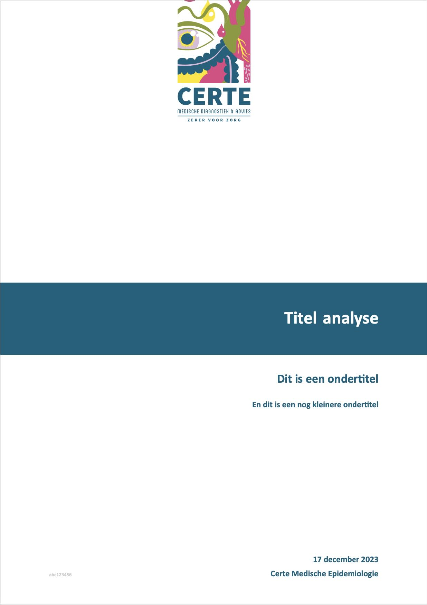
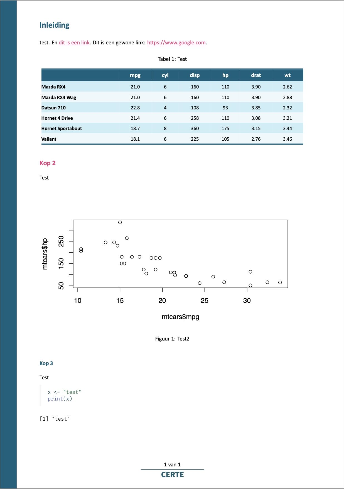
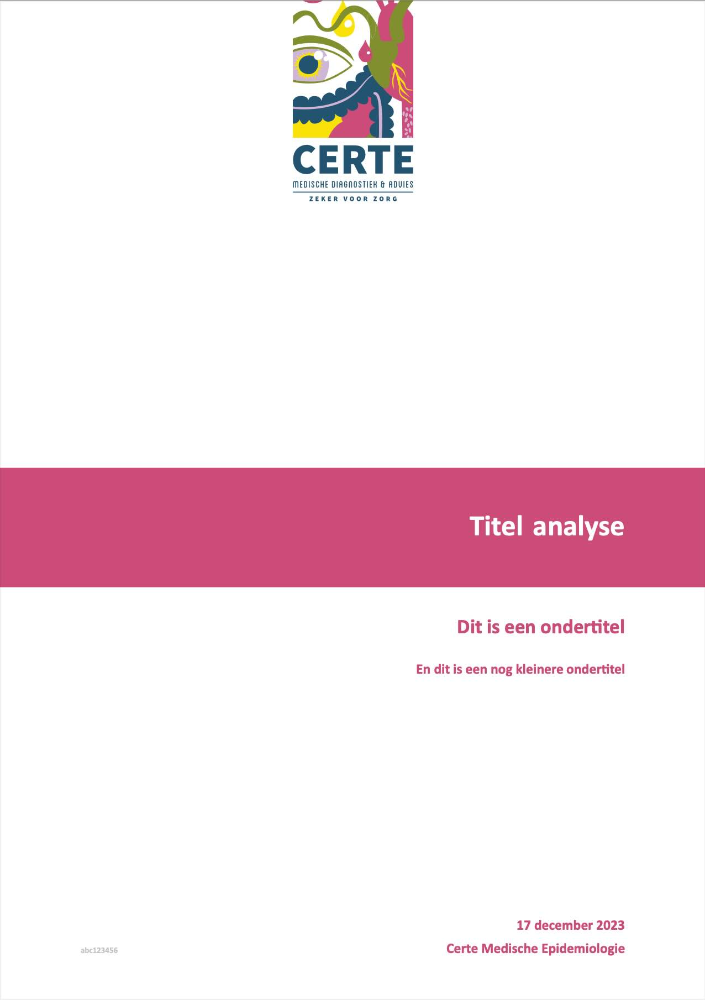
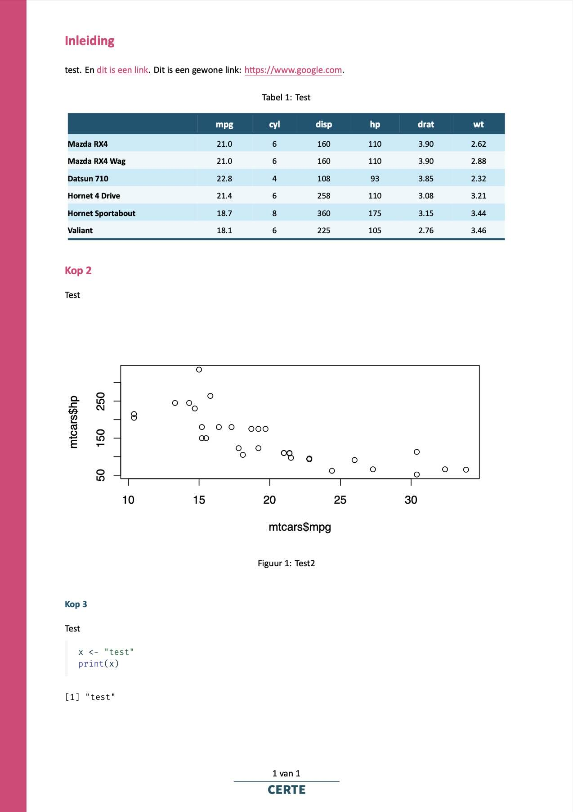
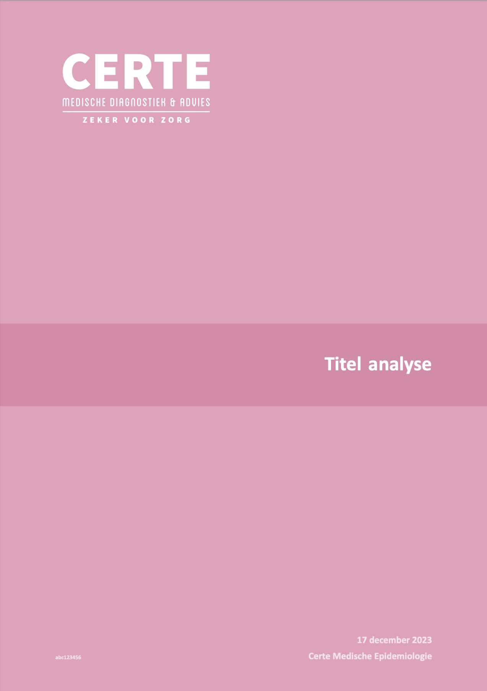
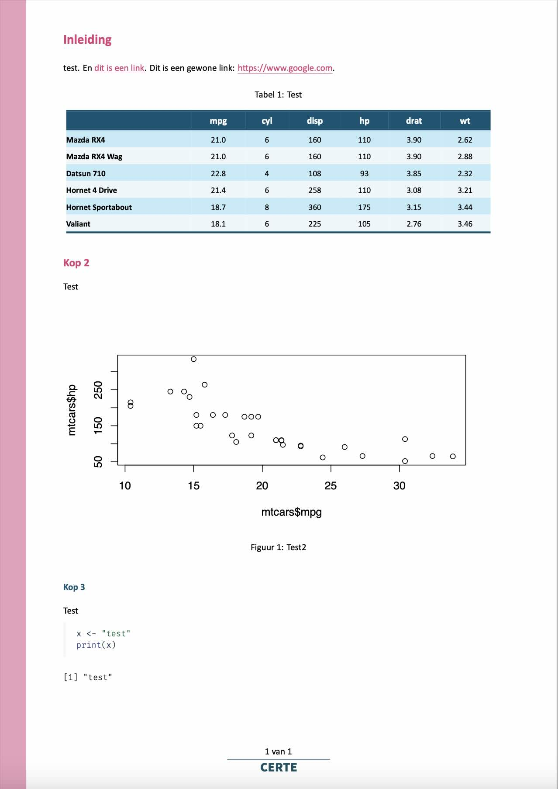

```{r, include = FALSE}
knitr::opts_chunk$set(
  collapse = TRUE,
  comment = "#>"
)
```

> The letters of the name *[TeX]* are meant to represent the capital Greek letters tau, epsilon, and chi, as TeX is an abbreviation of [τέχνη](https://en.wikipedia.org/wiki/Techne) (ΤΕΧΝΗ *technē*), Greek for both "art" and "craft", which is also the root word of *technical*. English speakers often pronounce it /tɛk/, like the first syllable of *technical*.
> 
> *[Wikipedia about](https://en.wikipedia.org/wiki/TeX#Pronunciation_and_spelling) the pronounciation of TeX*

This `certestyle` package comes with a [robust and flexible TeX template](https://github.com/certe-medical-epidemiology/certestyle/blob/main/inst/rmarkdown/latextemplate/certe.tex) designed for a variety of documentation needs. This template is an essential tool for creating our departments' high-quality documents. The template has a variety of options that can be set to alter the look and feel.

## Initialisation

The YAML header of a Quarto file (`.qmd`) or R Markdown file (`.Rmd`) should at least contain the formatting output to be PDF, the PDF engine, and the path to the TeX file:

```{yaml, eval = FALSE}
# for Quarto
format:
  pdf:
    pdf-engine: "xelatex"
    template: "/path/to/library/certestyle/rmarkdown/latextemplate/certe.tex"
lang: "nl"

# for R Markdown
output:
  pdf_document:
    latex_engine: "xelatex"
    template: "/path/to/library/certestyle/rmarkdown/latextemplate/certe.tex"
lang: "nl"
```

Note that this snippet is not required on Quarto if [making use of `_quarto.yaml` in a parent folder](https://quarto.org/docs/projects/quarto-projects.html#metadata-merging).

Setting `lang` will make sure that all automated TeX texts are translated, such as "Table of Contents", "List of Figures", "Table", "Figure", etc. This setting accepts an [ISO-639-1 code](https://en.wikipedia.org/wiki/List_of_ISO_639-1_codes) such as `"nl"` for Dutch and `"de"` for German.

## Title Page

The following so-called 'keys' can be set for the title page.

### `title`
The title for the document. If left blank or omitted, there will be **no title page**, thus ignoring `subtitle`, `subtitle2`, `author`, `date` and other title page related fields.

```{yaml, eval = FALSE}
title: "My title" # will add a title page
title: ""         # will omit a title page
                  # will also omit a title page
```

### `subtitle` / `subtitle2`
The subtitle(s) for the document. They will appear directly below the title. `subtitle2` will appear smaller than `subtitle`. Either can be used without the other.

```{yaml, eval = FALSE}
subtitle: "My subtitle"
subtitle2: "My smaller extra subtitle"
```

### `author`
The author name of the document. Can be omitted to leave blank. To automate, this can be `rmarkdown_author()` to read the key `user.{username}.fullname` from [the secrets file](certetoolbox::read_secret()). Be sure to add `certestyle::`, since no packages are loaded yet at the moment the YAML is being processed.

```{yaml, eval = FALSE}
author: "`r certestyle::rmarkdown_author()`"
```

### `date`
The date of the document. Can be omitted to leave blank. For R Markdown, this can be any text, so use e.g. `format2()` to format the date into the right format. But for Quarto, this *must* be in `YYYY-MM-DD`. You can then set the format using the `date-format` key. See [this Quarto page](https://quarto.org/docs/reference/dates.html) for date formats.

```{yaml, eval = FALSE}
# for Quarto
date: "`r Sys.Date()`" # R prints Date objects as YYYY-MM-DD, so that's safe
date-format: "D MMMM YYYY"

# for R Markdown
date: "`r certestyle::format2(Sys.Date(), 'd mmmm yyyy')`"
```

### `identifier`
This will be printed on the bottom left of the title page as a small string. For Certe projects, this should always be `certeprojects::project_identifier()`, which generates the project identifier automatically based on the file name or path:

```{yaml, eval = FALSE}
identifier: "`r certeprojects::project_identifier()`"
```


### `titlepage-logo`

The title page can contain a logo at the top of 16x7 cm, by setting `titlepage-logo` to an image or (preferably) a PDF file.

Currently included logos for the title page are:

```{r, echo = FALSE}
url <- "https://github.com/certe-medical-epidemiology/certestyle/blob/main/inst/rmarkdown/latextemplate/"
logos <- list.files(file.path(find.package("certestyle"), "rmarkdown", "latextemplate"),
                    pattern = "[.]pdf$",
                    include.dirs = TRUE,
                    recursive = FALSE,
                    full.names = FALSE)
logos <- sort(logos[!grepl("footer", logos)])
```

`r paste0("* [\u0060", logos, "\u0060](", url, logos, ")", collapse = "\n")`

Using `rmarkdown_logo()`, they can be set without the need to specify the library path.

```{yaml, eval = FALSE}
titlepage-logo: "`r certestyle::rmarkdown_logo('certe')`"
# or a custom path
titlepage-logo: "/path/to/library/certestyle/rmarkdown/latextemplate/certe.pdf"
```

For backwards compatibility, `logofront` can also be used instead of `titlepage-logo`.

## Figures, Tables, and Table of Contents

Setting the initial height and width of figures, and the table of contents (`toc`), is dependent on whether you use the TeX template for R Markdown or Quarto.

```{yaml, eval = FALSE}
# for Quarto
title: "Some title"
fig-width: 6.5
fig-height: 3.5
toc: true
toc-depth: 2

# for R Markdown
title: "Some title"
output:
  pdf_document:
    # notice the underscore (_), instead of a hyphen (-)
    # and placement below output > pdf_document
    fig_width: 6.5
    fig_height: 3.5
    toc: true
    toc_depth: 2
```

Values have to be set in inch, so remember that $cm = inch * 2.54$. The default figure width of 6.5 inch (16.5 cm) is approximately page-wide for A4 portrait.

Additionally, in Quarto, a List of Tables (`lot`) and a List of Figures (`lof`) can be printed. They are similar to a Table of Contents and will print just after the title page, by setting these keys to `true`. Their default is `false`.

```{yaml, eval = FALSE}
# Quarto
title: "Some title"
lot: true # List of Tables
lof: true # List of Figures
```

## Colours

All colours can be set separately, greatly influencing the look and feel of the resulting document. All colours must be set in HTML-codes, with or without `#`, such as `#000000` or `000000` for black. Colour names (such as `"black"`) do not work, unless `certestyle::colourpicker()` is used.

These are the defaults and what they mean:

```{yaml, eval = FALSE}
colour-titlepage-titlebanner: "#01617E" # horizontal banner colour for the title
colour-titlepage-full: "#FFFFFF" # full page colour for title page
colour-verticalbars: "#01617E" # 1 cm wide vertical bar to left (odd) and right (even) page edges
colour-title: "#FFFFFF" # colour of title
colour-subtitle: "#01617E" # colour of subtitle
colour-subtitle2: `colour-subtitle` # exception - this is the same as `colour-subtitle` at default
colour-author-date: "#01617E" # colour of author name and date on title page
colour-identifier: "#CBCBCB" # colour of project identifier on title page
colour-heading1: "#01617E" # colour of heading 1
colour-heading2: "#E04883" # colour of heading 2
colour-heading3: "#01617E" # colour of heading 3
colour-url: "#E04883" # colour of for URL's and href, so [text](www.site.com) and <www.site.com>
```

You can set these using a function as well:

```{yaml, eval = FALSE}
colour-titlepage-full: "`r certestyle::colourpicker('certeroze3')`"
```

#### Using `colour-main`

Furthermore, `colour-main` can be set as a default for the following fields:

* `colour-titlepage-titlebanner`
* `colour-verticalbars`
* `colour-subtitle`
* `colour-subtitle2`
* `colour-author-date`
* `colour-heading1`

This means that you can quickly change the primary colours of the template. You can set `colour-main` and then override some of the colours it sets.

```{yaml, eval = FALSE}
# set main colours to certeroze, but set heading 1 to red:
colour-main: "`r certestyle::colourpicker('certeroze')`"
colour-heading1: "#FF0000" # red
```

## Fonts

Use `mainfont` for the general font, and `monofont` for syntaxes. The default values are:

```{yaml, eval = FALSE}
mainfont: "Calibri"
monofont: "Fira Code"
```

They have to be installed on the system level. Cross-platform fonts (that are available on Windows, macOS, and Linux) are e.g. Verdana and Arial for `mainfont`, and Courier New for `monofont`.

## Footer

At the bottom of each page after the title page, you can remove the page numbers:

```{yaml, eval = FALSE}
remove-footer-page-numbers: true
```

The page numbers will be print in the format `"x of y"` Note that the text `" of "` is language-specific. This text is set in the TeX template and only supports `lang: nl` (which prints `"x van y"`) and `lang: de` (which prints `"x von y"`). It will assume Dutch if `lang` is not set. It will print `"x of y"` in all other cases.

Below the footer text, a PDF file can be placed, e.g. with a small organisational logo. It must be 16x0.7 cm.

```{yaml, eval = FALSE}
footer-logo: "`r certestyle::rmarkdown_logo('footer')`"
```

For backwards compatibility, `logofooter` can also be used instead of `footer-logo`.

## Examples

These examples work in both R Markdown and Quarto. For each example, this was set:

```{yaml, eval = FALSE}
title: "Titel analyse"
subtitle: "Dit is een ondertitel"
subtitle2: "En dit is een nog kleinere ondertitel"
author: "Certe Medische Epidemiologie"
date: "`r Sys.Date()`"
date-format: "D MMMM YYYY"
identifier: "abc123456"
# logo's
titlepage-logo: "`r certestyle::rmarkdown_logo('certe')`"
footer-logo: "`r certestyle::rmarkdown_logo('footer')`"
```

### Example 1: Default

This is the default; no additional formatting has been defined:

```{r, echo = FALSE, out.width = "40%"}


```

### Example 2: Colour change

This example sets `colour-main` to directly influence different elements such as the title page elements, and heading 1:

```{yaml, eval = FALSE}
colour-main: "`r certestyle::colourpicker('certeroze')`"
```

```{r, echo = FALSE, out.width = "40%"}


```

### Example 3: Full page colour

This example adds another logo (white Certe letters, aligned to the left) and uses `colour-titlepage-full` to give the title page a completely new look:

```{yaml, eval = FALSE}
# certeroze for main elements
colour-main: "`r certestyle::colourpicker('certeroze')`"

# certeroze2, somewhat lighter than certeroze
colour-titlepage-titlebanner: "`r certestyle::colourpicker('certeroze2')`"

# certeroze3, lighter than certeroze2
colour-titlepage-full: "`r certestyle::colourpicker('certeroze3')`"
colour-subtitle: "`r certestyle::colourpicker('certeroze3')`"  # this effectively makes text invisible
colour-subtitle2: "`r certestyle::colourpicker('certeroze3')`" # this effectively makes text invisible
colour-verticalbars: "`r certestyle::colourpicker('certeroze3')`"

# certeroze5, a very bright certeroze variant
colour-author-date: "`r certestyle::colourpicker('certeroze5')`"
colour-identifier: "`r certestyle::colourpicker('certeroze5')`"
```

```{r, echo = FALSE, out.width = "40%"}


```
